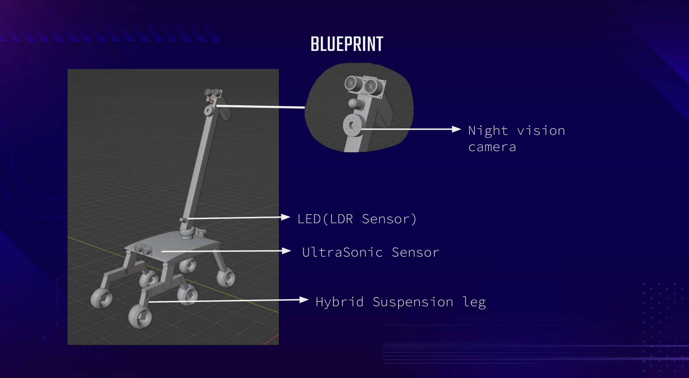

# Hyperion_BlindPeople_SmartRobot

**Hyperion** is a cutting-edge AI-powered robotic assistant designed specifically to enhance the mobility and independence of blind individuals. This smart robotic stick is equipped with a suite of advanced features including Face Recognition, Obstacle Avoidance, Object Detection, Text Recognition, and Voice Feedback, all integrated to provide seamless assistance in navigating through daily life.

---

## Project Description

In a world where technology continually reshapes the way we live, robotics stands at the forefront of innovation, particularly in healthcare. **Hyperion** represents a significant leap forward in assistive technology for the visually impaired. Blindness impacts millions globally, creating significant challenges in daily navigation and interaction with the environment. **Hyperion** is our solution—an intelligent, responsive robotic assistant that empowers blind individuals to move confidently through both familiar and unfamiliar spaces.

### Why Hyperion?

Imagine walking blindfolded in your own home—despite knowing your surroundings, a sense of vulnerability is inevitable. Now, extend this scenario to the everyday life of a blind person who must navigate countless unknown environments. This thought has driven us to develop **Hyperion**, a robot designed to be an indispensable guide, offering safety, autonomy, and peace of mind.

**Key Features:**
- **Face Recognition:** Identifies known individuals, providing comfort and safety during interactions.
- **Obstacle Avoidance:** Detects and navigates around obstacles to prevent collisions.
- **Object Detection:** Recognizes and informs the user of objects in their path.
- **Text Recognition:** Reads out text from signs, labels, and documents.
- **Voice Feedback:** Offers real-time auditory guidance and information.

---

## Demo

Experience **Hyperion** in action by watching our demo video:

---

## Vision and Impact

The development of **Hyperion** is driven by our commitment to making the world more accessible for everyone. By integrating advanced AI with practical robotics, we aim to provide a tool that not only assists but also empowers blind individuals to lead more independent and fulfilling lives. **Hyperion** is more than just a robotic stick—it's a step towards a future where no one is limited by their physical abilities.

---

## Contributing

We welcome contributions from developers, researchers, and anyone passionate about assistive technologies. Please feel free to submit issues, pull requests, or suggestions to help improve **Hyperion**.

---

## License

This project is licensed under the MIT License - see the [LICENSE](LICENSE) file for details.

---

## Acknowledgments

Special thanks to Dr. Rakesh Sanodiya of IIITS who have supported the development of **Hyperion**. Your dedication to innovation and inclusivity has made this project possible.

